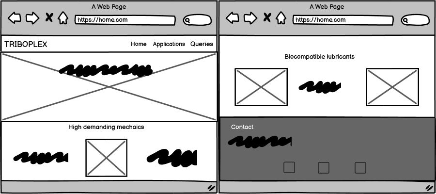

## Introduction
[Please visit the full live project here.](https://eandablo.github.io/triboplex/)

TRIBOPLEX is a website desgined to promote a fictitous company which offers bespoke solutions for industry facing tribological problems. The scope of TRIBOPLEX covers a different variety of industries from food to high demanding mechanical applications, which makes it unique.
In order to convince B2B users that TRIBOPLEX is the best option to find a solution, the webpage must convey the following:

- Knowledge of subject
- Resources
- Quality
- Experience
- Easy to contact

In order to properly convey the message to BB2 users the capacity of TRIBOPLEX to offers cost effective solutions the website contains three webpages: Home, applications and queries. Characteristics of each page will be presented in detail below.
The website is responsive down to screens with 350px wide.

## User Experience (UX)
### User stories
#### First time BB2 visitor
- I decided to first visit TRIBOPLEX as an employee of a company looking for a solution to a specific lubrication problem. I need to clearly understand TRIBOPLEX mission, their tools and knowledge on lubrication.
- I expect to find clear links to different parts of the website that tell a simple and informative story that invites to visit again after comparing with competitors website.
- I expect to find contact information and if possible links to socials. - I want to understand what kind of problems TRIBOPLEX has solved in the past and the level of satisfaction of their former clients.
#### Returning Visitor Goals
- If decided to return to the website, I would like to understand more in detail the kind of expertise in TRIBOPLEX and the variety of solutions they can offer that makes it to stand out over the competitors
- I want to find an easy way to contact to explain my problem in order to understand if TRIBOPLEX could be able to find a solution for my company problem.
### Wireframes
#### Home design
The header contains the simple logo of the company and links to the three different pages. Immediately below we find the hero-image with a small message to reiterate the purpose of the website. Following, the mission of the company is described in a section including a video. The next section is dedicated to the applications the company especialises on. To present the company reliability, a final section is added with feedback from other fictituous companies that have used the services of TRIBOPLEX in the past. The footer contains company contact details and link to the company socials.

#### Applications page design

The applications page keeps the header and hero image from the home page. This keeps users focus on the company professional aim. The applications is then divided into two sections presenting two very different aims. The first, mechanically demanding applications and second, biocompatible applications. These two completely different industriy examples will allow users to understand the flexibility of the company to provide solutions to opposite extreme sectors. The footer is kept from the home page.

#### Queries page design

This page keeps only the header from the home and applications pages for consistency.
The queries page is designed to allow users to ask for information about their especific problem and provide all the informatio needed for the company to contact them back.
The footer is also kept identical to the home and applications pages for consistency.

### Design

#### Fonts

The font Robot Slab was chosen for headers level from 1 to 4 and all paragraphs were given the font Signika. Besides their professional look this fonts allow easy readibility. As backup Georgia and sans-serif were used in that order.

#### Color scheme

A combination of three colors, #1b1b1b, white, and #ff78c5 was chosen to ensure compliance with the WCAG 2.0 minimum contrast and allowing also a professional look scoring high values in the contrast grid, which you can find following this [link](https://contrast-grid.eightshapes.com/?version=1.1.0&background-colors=&foreground-colors=%23FFFFFF%0D%0A%231B1B1B%0D%0A%23FF78C5&es-color-form__tile-size=compact&es-color-form__show-contrast=aaa&es-color-form__show-contrast=aa&es-color-form__show-contrast=aa18&es-color-form__show-contrast=dnp).

## Features

- Responsive down to screen widths of 350px. You can see the website in different devices [here](http://www.responsinator.com/?url=https%3A%2F%2Feandablo.github.io%2Ftriboplex%2F).
- Interactive elements such as input elements and video.

## Technologies

### Languages
- HTML5
- CSS3
### Frameworks
- [Google fonts](https://fonts.google.com/).

Robot Slab and Signika fonts were imported from google fonts into the CSS stylesheet of the project.
- [Fonts awesome](https://fontawesome.com/).

All icons for socials and links used throughout the website were obtained from Fonts awesome.
- [Github](https://github.com).

The project was stored and deployed in Github.
- [Codeanywhere](https://codeanywhere.com).

All project coding was created in Codeanywhere and pushed to github 
- [Balsamiq](https://balsamiq.com).

Wireframes were created using Balsamiq Wireframes Version: 4.7.2, Editor Version: 3.

## B2B user website experience

### Home page

The header contains the Logo of TRIBOPLEX and the main navigation menu floated at left and right, respectively. The header was given the property of sticky enhencing accesibility to other pages of the website at any point.
The hero image was carefully chosen to greet the user with the idea of aqueous lubrication, a simple but intelligent concept. This delivers a first idea of the mission of TRIBOPLEX even to the untrained user.
The text inside the hero image was colored in white since this allows a great contrast with the dark theme of the image without the need of a background banner.

The mission of TRIBOPLEX is explained in the section with header "meeting your lubrication needs". This section intends to explain the users the advantages of using the services of TRIBOPLEX and how different this company maybe from the competitors if compared. A video is provided to give additional information to non-experts users about the differences in lubricants. The video was obtained from the channel Engineering Materials-Tribology-Design.

The applications section visually illustrates the variety of problems TRIBOPLEX is able to tackle, namely, large mechanical friction, biological lubrication and surface coating. This simple section invites the user to learn more by visiting the applications page providing an additional direct link at the bottom of this section.

In order to ensure users of the reliability of the solutions provided by TRIBOPLEX a testimonial section was added with fictituous former clients testimonials. The section shows three abouts, each showing use of the examples presented in the applications section.

Opposite to the website elements presented above, the footer has a dark background (#1b1b1b) and white font color. The footer contains a first row with three columns giving contact information: address, email and landline. At the bottom, link for socials (facebook, instagram and twitter) are also provided.

### Applications page

The applications page keeps the header and hero image from the home page. The only change is the text in the hero image that remarks the intention of this page, telling the users the many ways TRIBOPLEX ca help.

The first section is dedicated to highlu demanding mechaical applications which is divided in three columns. Righ and left columns give a brief description of the quelities desirable for lubricant working under these conditions. The central image of a gear box help the user to focus immediately in the context of the section.

The second section is dedicated to biological applications also with three columns. In this case, left and right abouts show images with simple examples of food and cosmetic industries helping the user to focus on the section subject. The text is concise explaining why lubrication is an important consideration in both applications.
As ca be observed below the section, the footer remains the same as in the home page for consistency.

### Queries page

The queries page provides the space for the user to send request for information and contact easily the TRIBOPLEX team. The form is divided in two columns still following an industry standard order for the fields. On hovering the border of the fields become blue and on focus the background turns to a pinkish color wich in combination with the dark font color allows a contrast compliant with industry standards as evident on the 8.7 score in the contrast grid (https://contrast-grid-eightshapes.com).

The form does not use any method and on clicking on the submit button it references to a dummy page having the same structure but just showing an acknoledgement message as shown in the image below.

## Testing

HTML5, CSS3 were checked using the W3C valitadors and no errors were found.

- HMTL5
    - [Index](https://validator.w3.org/nu/?checkerrorpages=yes&useragent=Validator.nu%2FLV+http%3A%2F%2Fvalidator.w3.org%2Fservices&acceptlanguage=&doc=https%3A%2F%2Feandablo.github.io%2Ftriboplex%2F)
    - [Applications](https://validator.w3.org/nu/?doc=https%3A%2F%2Feandablo.github.io%2Ftriboplex%2Fapplications.html)
    - [Queries](https://validator.w3.org/nu/?doc=https%3A%2F%2Feandablo.github.io%2Ftriboplex%2Fqueries.html)
    - [Queries-dummy](https://validator.w3.org/nu/?doc=https%3A%2F%2Feandablo.github.io%2Ftriboplex%2Fqueries-dummy.html%3Ffull-name%3Dasd%26job-title%3Das%26company%3Dasd%26street-address%3Dasd%26city%3Dasd%26email-address%3Dasd%2540asd.com%26product-interest%3Dbiocompatibility-Food%26information%3Dasd)
- [CSS3](https://jigsaw.w3.org/css-validator/validator?uri=https%3A%2F%2Feandablo.github.io%2Ftriboplex%2Findex.html&profile=css3svg&usermedium=all&warning=1&vextwarning=&lang=en)

## Deployment

The project was deployed to GitHub Pages using the following steps:

1. Log in to GitHub and locate the [TRIBOPLEX GitHub Repository](https://github.com/eandablo/triboplex)
2. At the top of the Repository, locate the "Settings" Button on the menu.
3. Scroll down the Settings page until you locate the "GitHub Pages" Section.
4. Under "Source", click the dropdown called "None" and select "Master Branch".
5. The page will automatically refresh.
6. Scroll back down through the page to locate the now published site [link](https://eandablo.github.io/triboplex/) in the "GitHub Pages" section.

## Credits

### Code
- Import statement in stylesheets for primary fonts was obtained from [Google fonts](https://fonts.google.com/).
- Script statement for icons used in socials and links were obtained at [Fonts awesome](https://fontawesome.com/).

### Content
- Triboplex website content was created by Efren A Andablo Reyes.
- Deployment steps cited in this readme file were obtained from the Code Institute website [readme file](https://github.com/Code-Institute-Solutions/SampleREADME/blob/master/README.md?plain=1).

### Media
- Youtube video titled [Lubricant Types and Properties](https://www.youtube.com/watch?v=t6RL7SkfAQU) presented in "Meeting your needs" section belongs to the channel Engineering Materials-Tribology-Design.
- Images were obtained from [pexels.com](https://pexels.com).

### Acknowledgement
- Special acknowkedge to my mentor Dario Carrasquel for his guidence.